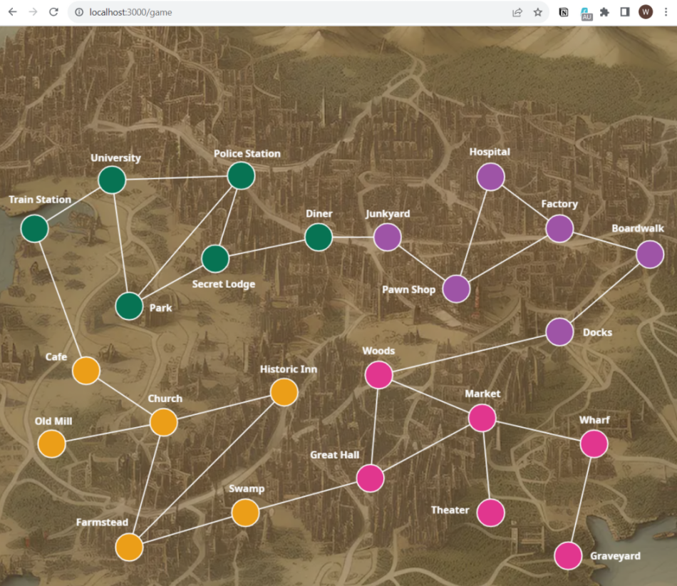

# Pandemic - Reign of Cthulhu 

Battle eldritch horrors with your allies to avert cosmic chaos in the pandemic - reign of Cthulhu

## Overview
This is an interactive web game that brings the board game with the same title to digital implementation in TypeScript and Python.

To understand the rule of the game, see [the manual at here](https://www.zmangames.com/en/products/pandemic-reign-cthulhu/) 

The screenshot below shows current map, cards in the frontend application

| |  |   |
|-|-|-| 

## Setup
See the documentation below to build both of the client and server applications
- [`/frontend/README.md`](./frontend/README.md)
- [`/backend/README.md`](./backend/README.md)

See [REST API documentation](https://game-as-a-service.github.io/Pandemic-Reign-of-Cthulhu/doc/api/) to understand how client and server applications interact with each other.

## License
GPL 3.0

## Contribution
### Follow the software engineering / development practices
Core maintainers initiated this game project with a strong emphasis on practicing the techniques below, all code contribtutors are required (and encouraged) to adhere to these good practices. If you don't know any of them, this is a good opportunity to learn with us. 
- [Clean code](https://gist.github.com/metalalive/38563d633fe207e16c7b96b47522b646) , see references :
  - [Clean Code Handbook Software Craftsmanship - Robert C. Martin](https://www.amazon.com/Clean-Code-Handbook-Software-Craftsmanship/dp/0132350882)
- [Clean architecture](https://blog.cleancoder.com/uncle-bob/2012/08/13/the-clean-architecture.html) , see references :
  - [ITkonekt 2019 | Robert C. Martin (Uncle Bob), Clean Architecture and Design](https://www.youtube.com/watch?app=desktop&v=2dKZ-dWaCiU)
  - [detailed summary of the Clean Architecture book](https://github.com/serodriguez68/clean-architecture)
- [ATDD - Acceptance Test-Driven Development](https://en.wikipedia.org/wiki/Acceptance_test-driven_development), see references :
  - [Test Driven Development Tutorial For Beginners](https://youtu.be/yfP_v6qCdcs?si=vVRI1yhbuqKkMCkJ)
  - [Explain Acceptance Test-Driven Development](https://softwareengineering.stackexchange.com/a/33263/346703)
- [GitHub flow](https://docs.github.com/en/get-started/quickstart/github-flow)

### Always test your code changes
If you are adding or modifying application-specific logic to the game, be sure to run test cases and linter for syntax check before submitting your code.

### Discussion before making any change
Contributors are always encouraged to interact with the maintainers of this codebase, by starting a discussion in following places
- [GitHub Issue](https://github.com/Game-as-a-Service/Pandemic-Reign-of-Cthulhu/issues) , for features, refactor, bugfix, build script, and minor changes like typo/error in the code and documentation.
- [GitHub Discussion](https://github.com/Game-as-a-Service/Pandemic-Reign-of-Cthulhu/discussions) , for architecture/design discussion, or questions about any technology / tool / 3rd-party library applied to the game.

### Following the naming convention
- [Git commit message format](https://github.com/Game-as-a-Service/Pandemic-Reign-of-Cthulhu/discussions/7)
- [Git branch naming convention](https://dev.to/varbsan/a-simplified-convention-for-naming-branches-and-commits-in-git-il4)

### Work with your development branch
After discussion, what you can do is to
- create your development branch, with the naming convention described above
- push commits / the code change to the branch
- create a PR (pull request) if you are ready to merge your development branch into the main branch, there will be core maintainer(s) coming / reviewing your code change.

Remember to keep code change in your development branch small and manageable, to make reviewers' life easier ;)

### Styling
Always run the linter in frontend / backend development environment, to ensure you code adheres to the required style.

## Reference
- Previous discussion on [Miro](https://miro.com/app/board/uXjVMO8BrcQ=) (Chinese only)
- Graphical Design and material on [Fimga](https://www.figma.com/file/MfUa9gGZLUq2xB5QXA6KFJ/%E7%98%9F%E7%96%AB%E5%8D%B1%E6%A9%9F---%E5%85%8B%E8%98%87%E9%AD%AF%E7%9A%84%E6%94%AF%E9%85%8D?type=design&node-id=0-1&mode=design)
- Previous project management page on [Notion](https://www.notion.so/6c32aaca13714324942d5ea81e1e80c5) (outdated)
